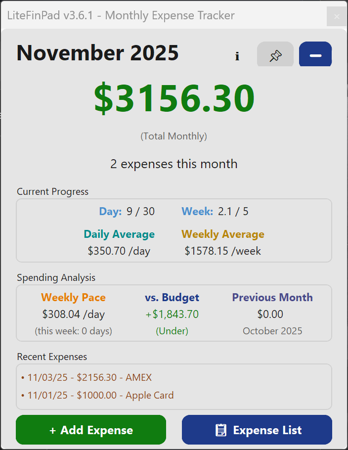
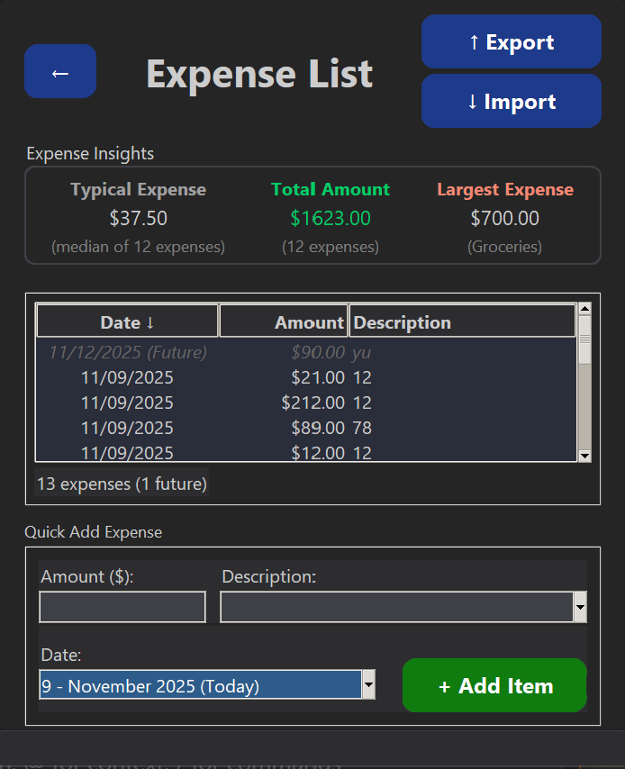

# LiteFinPad v3.6.1

<div align="center">


**A lightweight, open-source, offline Windows expense tracker**


</div>

---

## INTRODUCTION

Hello World! I'm a beginner to software development and dabbling in the AI-enhanced tech world when I have time to take breaks from my full-time career. 

This is my first "microapp" project coded with the help of Cursor AI (using Claude Sonnet 4 as my primary model of choice). The development framework is a combination of Python (business logic), Tkinter (GUI) & CustomTkinter (GUI).

Inspired to think more seriously about my spending habits from watching Caleb Hammer's Financial Audit YouTube series, I built it for my own personal use to solve a need to quickly keep track of large, monthly expenses (without trying to manage finances on my phone). While it wasn't a one-shot app, I've been learning a lot about software development and how hard it actually is to build software (despite having powerful AI tools to assist me)... I don't know how developers did it before AI tools were a thing. 

I don't know if it will work for everyone else's machines, but I felt my project was stable enough for daily use to release and open source it out for the public.

Check my Beginner_Thoughts.md file for how my AI-assisted development's journey been if you're curious :).

Feedback to improve is welcome!

## Overview

**LiteFinPad** is a Windows application for quickly tracking monthly personal expenses. It offers a clean, functional interface, system tray integration, simple financial analytics, and offline data management.

**Perfect for**:
- Personal finance tracking
- Monthly budget monitoring  
- Quick expense logging without opening apps
- Users who want complete data privacy (no cloud, no accounts)

---

## Screenshots

<div align="center">

<table>
<tr>
<td align="center">

<br>
<em>Main dashboard spending tracker</em>
</td>
<td align="center">

<br>
<em>Detailed Expense list with quick add functionality</em>
</td>
</tr>
</table>

</div>

---

## What's New

### v3.6.1 - Dark Mode (Experimental)
- **Dark Mode Theme**: Modern dark color scheme for reduced eye strain
- Enable/disable via `settings.ini` (see Configuration section)
- Fully theme-aware across all UI components
- Works seamlessly with Archive Mode

### v3.6 - Budget Tracking & Improvements
- **Budget Threshold Tracking**: Set monthly spending limits and monitor over/under status with color-coded indicators
- **Quick Add Autocomplete**: Intelligent expense description suggestions for faster entry
- **Archive Mode Fixes**: Improved display updates and tooltip behavior
- **Code Quality**: Better error handling and code organization

---

## Previous Releases

### v3.5.3 - Archive Mode & Export Features
- Archive Mode for viewing historical data
- System tray context menu
- One-click Excel/PDF exports
- Spending trend indicators

### v3.5.2 - Quick Add Dialog Fix
- Fixed threading issue with Quick Add dialog
- Restored reliable tray icon functionality

### v3.5.1 - Dialog System Improvements
- Centralized dialog system
- Optional debug mode

### v3.5 - Major Update
- New modular architecture
- Centralized configuration
- Enhanced stability

---

## Key Features

### Core Functionality
- **Quick Expense Entry**: Three ways to add expenses (inline, dialog, tray icon)
- **Real-time Analytics**: Monthly totals, weekly/daily averages, spending trends
- **Minimal Budget Tracking**: Set monthly spending threshold and monitor over/under status
- **Organized Data Storage**: Automatic monthly folders, JSON-based storage
- **Full Expense Management**: View, edit, delete, and search expenses
- **Export Options**: Excel (.xlsx) and PDF formats with professional styling

### User Experience
- **Modern Interface**: Clean, professional design with intuitive navigation
- **Keyboard Shortcuts**: Enter for navigation, Escape to close dialogs
- **System Tray Integration**: Always accessible, minimal screen footprint
- **Stay on Top Mode**: Keep tracker visible while working
- **Smart Dialogs**: Auto-focus, intelligent positioning, number pad support

### Technical Highlights
- **Fully Offline**: No internet required, no tracking, no cloud sync
- **Automatic Backups**: Monthly archives with zero data loss
- **Lightweight**: ~23 MB distribution, fast startup
- **Data Validation**: Real-time input validation prevents errors
- **Single Executable**: No Python installation required

---

## Quick Start

### Option 1: Download Pre-Built Executable (Recommended)

1. Go to the [Releases](https://github.com/aHuddini/LiteFinPad/releases) page
2. Download the latest release
3. Extract and run `LiteFinPad_v3.x.x.exe`
4. Look for the icon in your system tray

**No Python installation required. Just download and run.**

### Option 2: Run from Source

**Requirements**: Python 3.11+ (3.14 recommended), Windows 10+

```bash
# Clone the repository
git clone https://github.com/yourusername/LiteFinPad.git
cd LiteFinPad

# Install dependencies
python -m pip install -r requirements.txt

# Run the application
python main.py
```

---

## Usage

### First Launch
1. Application starts minimized in your system tray (bottom-right corner)
2. Click the system tray icon to open the main window
3. Start adding expenses

### Adding Expenses (3 Methods)

#### Method 1: Inline Quick Add (Fastest)
- Located at the bottom of the "Expense List" page
- Type amount → Press Enter → Type description → Press Enter
- Perfect for rapid consecutive entries

#### Method 2: Add Expense Dialog
- Click "+ Add Expense" button on Expense List page
- Includes optional number pad for touch screens
- Amount → Enter → Description → Enter to submit

#### Method 3: Quick Add from Tray (Stealthiest)
- Double-click the system tray icon
- Add expense without opening main window
- Great for quick logging on the go

### Keyboard Shortcuts
| Key | Action |
|-----|--------|
| `Enter` | Navigate between fields / Submit form |
| `Escape` | Close current dialog |
| `Double-click tray icon` | Open Quick Add dialog |

### Managing Expenses
- **View**: All expenses listed on main "Expense List" tab
- **Edit**: Right-click any expense → "Edit"
- **Delete**: Right-click any expense → "Delete"
- **Export**: Click "Export" → Choose Excel or PDF

### Setting Your Monthly Budget
1. On the Dashboard, find the "vs. Budget" section in the Spending Analysis area
2. Click on the budget amount or status label (e.g., "Not set" or "(Click Here)")
3. Enter your monthly spending threshold using the number pad or keyboard
4. Click "Set" to save your budget
5. The dashboard will immediately update to show:
   - **Green amount**: How much you're under budget (e.g., "+$500.00")
   - **Red amount**: How much you're over budget (e.g., "-$200.00")
   - **Status**: "(Under)" or "(Over)" indicator
6. Your budget persists across sessions and updates automatically as you add expenses

---

## Configuration

LiteFinPad uses a `settings.ini` file in the application directory to store user preferences and configuration options. You can edit this file with any text editor to customize the application behavior.

### Location
The `settings.ini` file is located in the same directory as the application executable (or `main.py` if running from source).

### Available Settings

#### Theme Settings
```ini
[Theme]
dark_mode = true    # Enable dark mode (true) or light mode (false)
```

**Dark Mode (Experimental):**
- Set `dark_mode = true` to enable the dark theme
- Set `dark_mode = false` to use the default light theme
- Changes take effect after restarting the application
- Works seamlessly with Archive Mode

#### Budget Settings
```ini
[Budget]
monthly_threshold = 5000.0    # Your monthly spending budget (decimal number)
```

**Monthly Budget:**
- Set your monthly spending threshold as a decimal number
- Can also be set via the Budget Dialog in the application (click "vs. Budget" on dashboard)
- Value persists across sessions

#### Table Settings
```ini
[Table]
sort_column = Date    # Default sort column (Date, Amount, Description)
sort_order = desc     # Sort order (asc or desc)
```

**Table Preferences:**
- `sort_column`: Default column to sort by when viewing expense list
- `sort_order`: Default sort direction (ascending or descending)

#### Export Settings
```ini
[Export]
default_save_location =    # Default folder for exports (leave empty for system default)
```

**Export Preferences:**
- Leave empty to use system default download folder
- Set a custom path to always export to a specific location

#### Logging Settings
```ini
[Logging]
debug_mode = false    # Enable debug logging (true) or disable (false)
```

**Debug Mode:**
- Set `debug_mode = true` for detailed logging (useful for troubleshooting)
- Logs are saved to the `logs/` directory
- Default is `false` for normal operation

#### AutoComplete Settings (Advanced)
```ini
[AutoComplete]
show_on_focus = true      # Show suggestions when field receives focus
min_chars = 2             # Minimum characters before filtering suggestions
max_suggestions = 5        # Maximum suggestions to display
max_descriptions = 50     # Maximum descriptions to track in history
```

**AutoComplete Preferences:**
- Controls behavior of description suggestion dropdown
- Adjust these if you want more/fewer suggestions or different behavior

### Editing Settings

1. Close the application (if running)
2. Open `settings.ini` in any text editor (Notepad, VS Code, etc.)
3. Modify the values as needed
4. Save the file
5. Restart the application for changes to take effect

**Note:** Be careful when editing - invalid values may cause the application to use defaults or fail to start. Always keep a backup of your `settings.ini` file.

---

## Project Structure

For developers, the project is organized into modular components:

- **Core modules**: `main.py`, `gui.py`, `expense_table.py`, `analytics.py`
- **System integration**: `tray_icon.py`, `window_animation.py`
- **Data management**: `export_data.py`, `import_data.py`, `data_manager.py`
- **Utilities**: `error_logger.py`, `validation.py`, `config.py`

Monthly expense data is stored in `data_YYYY-MM/` folders (auto-created).

For detailed technical documentation, see the `/docs` folder.

---

## Building from Source

```bash
# Development build
build_dev.bat

# Production release
build_release.bat
```

**Output**: `dist/LiteFinPad_vX.X/LiteFinPad_vX.X.exe`

For complete build instructions and options, see [BUILD_SYSTEM_GUIDE.md](docs/user/BUILD_SYSTEM_GUIDE.md).

---

## Dependencies

### Core Libraries
| Library | Version | Purpose | License |
|---------|---------|---------|---------|
| **pywin32** | 306+ | System tray integration | PSF License |
| **xlsxwriter** | 3.2.0+ | Excel export | BSD License |
| **fpdf** | 1.7.2 | PDF generation | LGPL |

### Build Tools
| Tool | Version | Purpose |
|------|---------|---------|
| **PyInstaller** | 6.16.0+ | Executable creation |
| **Python** | 3.11+ | Runtime (3.14 recommended) |

For complete dependency information, see [DEPENDENCIES.md](docs/developer/DEPENDENCIES.md).  
For third-party licenses, see [THIRD_PARTY_LICENSES.md](docs/developer/THIRD_PARTY_LICENSES.md).

---

## Version History

| Version | Date | Highlights |
|---------|------|------------|
| **3.6.1** | Nov 2025 | Dark Mode (Experimental), settings.ini documentation |
| **3.6** | Nov 2025 | Budget threshold tracking, quick add autocomplete, archive mode improvements |
| **3.5** | Oct 2025 | Archive mode, export features, system tray improvements |
| **3.4** | Oct 2025 | Keyboard shortcuts, Enter navigation, Escape key support |
| **3.3** | Oct 2025 | Enhanced import validation, real-time input validation |
| **3.2** | Oct 2025 | Inline Quick Add, expense list enhancement |
| **3.1** | Oct 2025 | UX enhancements, animation optimization |
| **3.0** | Oct 2025 | Stable release, slide-out animations |

For complete version history, see [CHANGELOG.md](CHANGELOG.md).

---

## Design Philosophy

LiteFinPad follows these core principles:

1. **Offline First**: Your data stays on your machine. No cloud, no tracking, no accounts.
2. **Lightweight & Fast**: Small footprint (~23 MB), instant startup, minimal resources.
3. **User-Centric Design**: Built for rapid data entry with keyboard shortcuts and smart defaults.
4. **Zero Dependencies**: Single executable, no Python installation required for end users.
5. **Transparent & Open**: Full source code available, clear documentation, open license.

---

## Contributing

LiteFinPad is currently a personal project, but contributions are welcome!

### How to Contribute
1. Fork the repository
2. Create a feature branch (`git checkout -b feature/amazing-feature`)
3. Make your changes and test thoroughly
4. Commit with clear messages (`git commit -m 'Add amazing feature'`)
5. Push to your branch (`git push origin feature/amazing-feature`)
6. Open a Pull Request

### Development Setup
```bash
# Clone and install
git clone https://github.com/yourusername/LiteFinPad.git
cd LiteFinPad
python -m pip install -r requirements.txt

# Run in development mode
python main.py

# Build for testing
build_dev.bat
```

---

## License

LiteFinPad is licensed under the **MIT License**. See [LICENSE](LICENSE) for details.

**In short**: Free to use, modify, and distribute. No warranties provided.

### Third-Party Licenses
This project uses open-source libraries with permissive licenses. All attributions and license texts are available in [THIRD_PARTY_LICENSES.md](docs/developer/THIRD_PARTY_LICENSES.md).

## Acknowledgments

Built with the help of:
- **Mark Hammond** - pywin32 library for Windows integration
- **John McNamara** - xlsxwriter for Excel export
- **Olivier Plathey** - fpdf library for PDF generation
- **Python Software Foundation** - Python language and standard library

## Support

- **Issues**: [GitHub Issues](../../issues)
- **Documentation**: See `/docs` folder for detailed guides
- **Build Help**: [BUILD_SYSTEM_GUIDE.md](docs/user/BUILD_SYSTEM_GUIDE.md)

## ⚠️ DISCLAIMER

- **This is a personal project** built by a beginner developer with AI assistance
- **Windows-only** - designed for Windows 10+
- **No automated testing** - tested manually for daily use
- **Use at your own risk** - backup your data regularly

## Future Plans

Potential features under consideration (not committed):
- Category-based expense tracking
- Visual charts and graphs
- Import from CSV/Excel
- Multi-language support
- Local AI parsing

**Note**: LiteFinPad prioritizes simplicity and stability. Features are added conservatively.

---

<div align="center">

**Made for personal finance tracking**

⭐ Star this repo if you find it useful!

</div>
